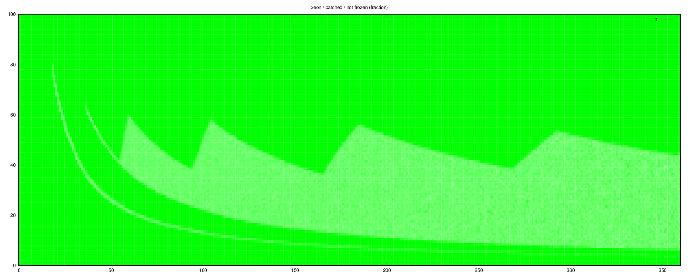
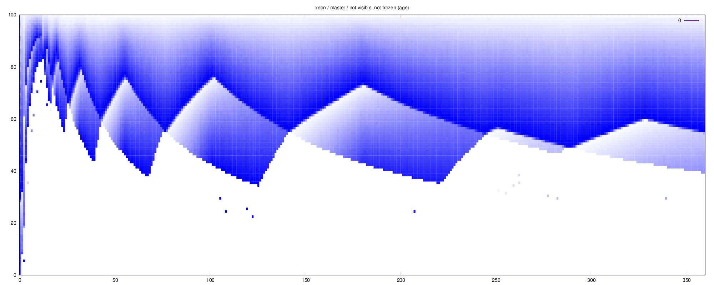
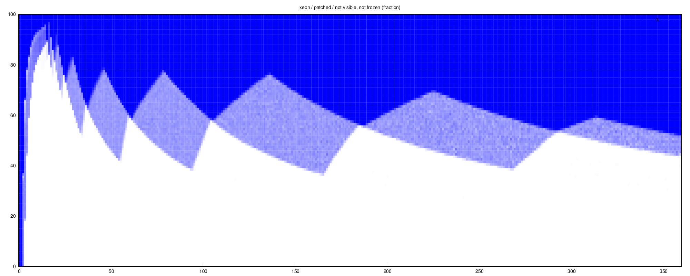
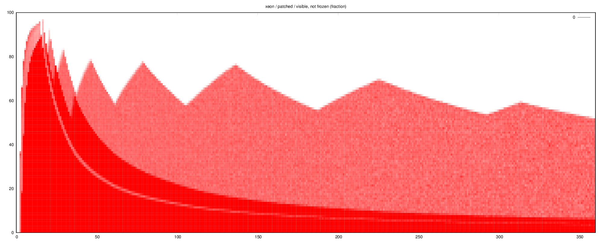

# debt - not visible / not frozen

# debt - summary - pct

# debt - summary

# debt - visible / not frozen - pct

# heatmap - not frozen - age

# heatmap - not frozen - pct

# heatmap - not visible / not frozen - age

# heatmap - not visible / not frozen - pct

# heatmap - visible / not frozen - age

# heatmap - visible / not frozen - pct

